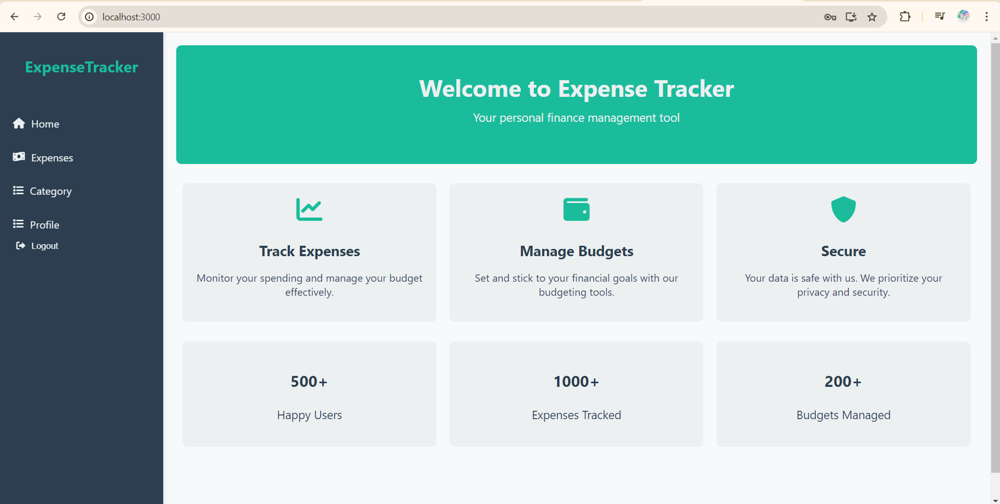
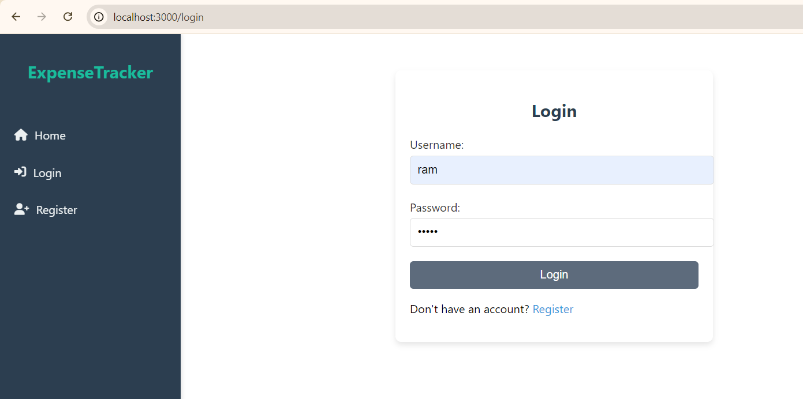
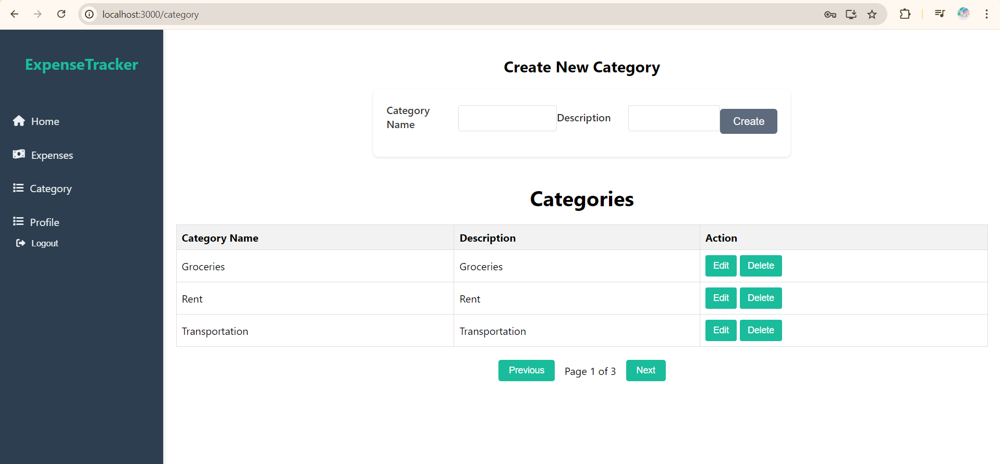
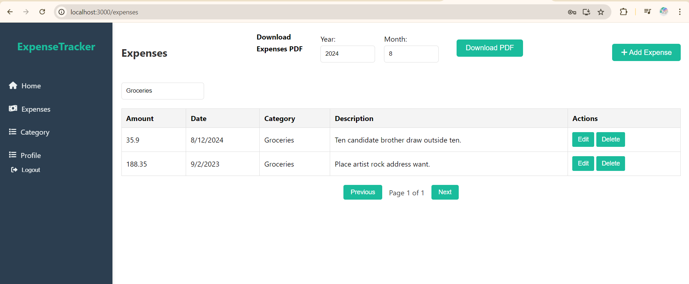
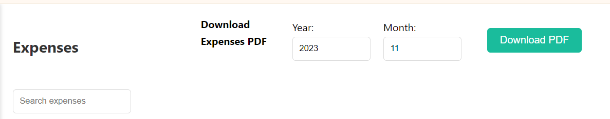
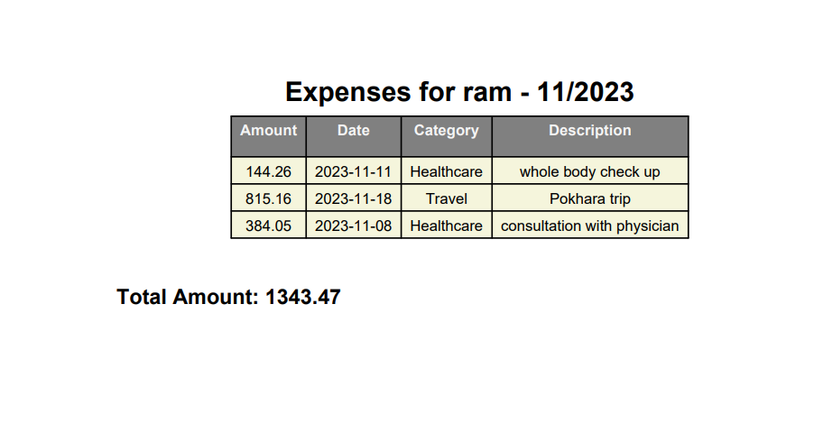

# Expenses Tracker

A web application for tracking personal expenses and managing budgets, built using Django for the backend and React for the frontend. This project also utilizes Docker for containerization and PostgreSQL as the database.

## Features

- Track and manage personal expenses.
- Categorize expenses and  export them as PDF files.
- Responsive and user-friendly UI.
- User authentication and authorization.
- Dockerized setup for easy deployment.

## Technologies

- Frontend: React, Tailwind CSS, Next UI
- Backend: Django REST Framework
- Database: PostgreSQL
- Containerization: Docker, Docker Compose

## Installation

### Prerequisites

- Docker and Docker Compose installed on your machine.

- Steps
1. Clone the repository:
    ```sh
    git clone https://github.com/your-username/expenses-tracker.git
    ```

2. Navigate to the project directory:
    ```sh
    cd expensestracker
    ```

3. Build and Start the Application:
    ```sh
    docker-compose up --build
    ```

## Usage

- Frontend: Access the application at http://localhost:3000.

- Backend API: The API is available at http://localhost:8000/.

- pgAdmin: If you are using pgAdmin, connect to the PostgreSQL database using the following settings:

    - Host: localhost

    - Port: 5432

    - Username: postgres

    - Password: postgres

## Configuration

- Database Configuration: Ensure the database settings in the .env file match your environment:

    - POSTGRES_USER=postgres
    - POSTGRES_DB=expenses-tracker
    - POSTGRES_PASSWORD=postgres
    - POSTGRES_HOST=db
    - POSTGRES_PORT=5432

## Running with Docker

- Steps
1. Start Docker Containers:
    ```sh
    docker-compose up
    ```

2. Stop Docker Containers:
    ```sh
    docker-compose down
    ```

3. Rebuild Docker Containers (if you make changes to Dockerfiles):
    ```sh
    docker-compose up --build
    ```

## Screenshots

Here are some screenshots of the application:







